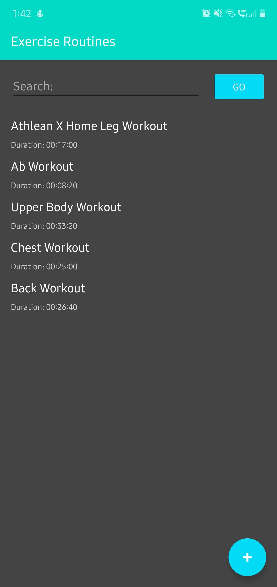
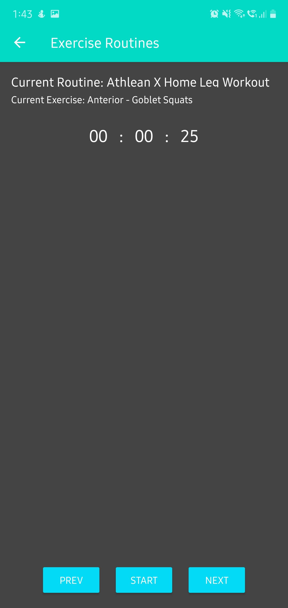

# exercise-routines

This is an android application developed in Kotlin. I developed this application during the lockdown to help myself to keep track of all my home workouts and perform the same without using the internet.

It has a very minimal and simplistic design with a dark theme throughout the application. In this application, we can add/edit/delete a workout/routine and in it we can add/edit exercises along with their time. We can also start a workout/routine, in which a timer is used to run an exercise for a given duration.

## Pending Items

- Search Funcationality
- Ability to delete an exercise from a workout/routine

## Future Releases

- Ability to import/export workouts/routines

## Screenshots and Screen Recording

## Queries?

email me at pranavj1001@gmail.com

## License

MIT License
